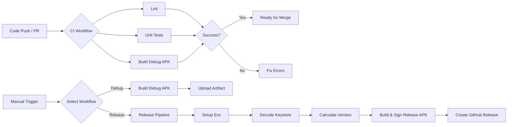

# Product Requirements Document (PRD)

## Overview
The goal is to implement an enterprise-grade CI/CD pipeline for the Android application using GitHub Actions. This pipeline will automate testing, building, and releasing the application, ensuring high code quality and reliable deployments.

## Requirements

### 1. Continuous Integration (CI)
*   **Trigger:** Push to `main`/`master` and all Pull Requests.
*   **Actions:**
    *   **Linting:** Run code linting to ensure code style and catch potential errors.
    *   **Unit Tests:** Execute unit tests to verify business logic.
    *   **Build Verification:** Compile a Debug APK to ensure the codebase is buildable.

### 2. Manual Debug Build
*   **Trigger:** Manual invocation (`workflow_dispatch`).
*   **Actions:**
    *   Build a Debug APK.
    *   Upload the APK as a workflow artifact for testing purposes (retention: 7 days).

### 3. Release Pipeline
*   **Trigger:** Manual invocation (`workflow_dispatch`).
*   **Actions:**
    *   **Secure Signing:** Decode the keystore from secrets and sign the APK.
    *   **Auto-Versioning:** Automatically calculate the next semantic version based on Git tags.
    *   **Build Release:** Build a signed Release APK.
    *   **Publish:** Create a GitHub Release with the new version tag and upload the signed APK.

## Pipeline Flow

