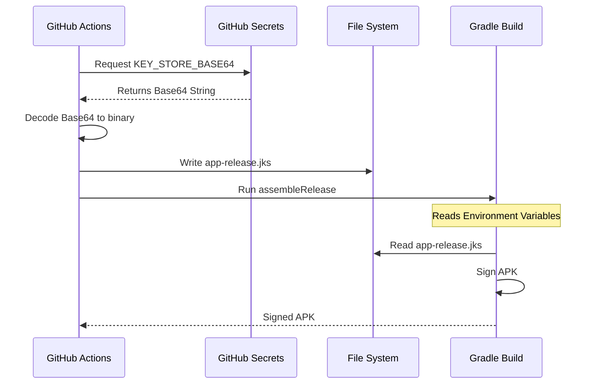

# Technical Design (TD)

## Architecture
The CI/CD pipeline is built using GitHub Actions. It leverages standard Android build tools (Gradle) and GitHub-hosted runners (Ubuntu-latest).

### Workflows
1.  **CI (`ci.yml`)**: Focuses on code quality and build integrity. It runs in parallel jobs for efficiency.
2.  **Manual Debug (`manual_debug.yml`)**: specific for generating testable binaries without releasing.
3.  **Release (`release.yml`)**: Handles the sensitive process of signing and publishing.

## Secret Management
We use GitHub Secrets to store sensitive information. The Keystore is stored as a Base64 encoded string to avoid committing binary files to the repository.

*   `KEY_ALIAS`: The alias of the key in the keystore.
*   `KEY_PASSWORD`: The password for the key.
*   `KEY_STORE_PASSWORD`: The password for the keystore.
*   `KEY_STORE_BASE64`: The Base64 encoded content of the `.jks` file.

### Secret Generation
To generate the `KEY_STORE_BASE64` secret, run this PowerShell command:
`[Convert]::ToBase64String([IO.File]::ReadAllBytes('app-release.jks'))`

## Semantic Versioning
The pipeline implements automated semantic versioning (`Major.Minor.Patch`).
*   It fetches existing Git tags.
*   It sorts them to find the latest version.
*   It increments the Patch version (e.g., `1.0.0` -> `1.0.1`).
*   If no tags exist, it defaults to `1.0.0`.

## Signing Process
The signing configuration is injected into the build process via environment variables. The `build.gradle` file is modified to read these variables during the release build type execution.

